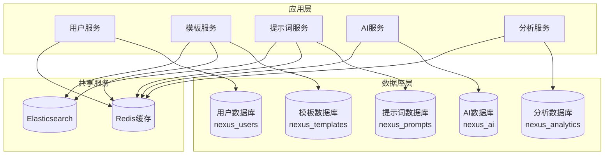

# Nexus AI Platform - 数据库设计文档

**版本**: 1.0  
**更新日期**: 2024年12月2日  
**作者**: 数据库团队  
**审核人**: 数据架构师、技术负责人  

---

## 📋 文档信息

| 项目 | 内容 |
|------|------|
| **数据库类型** | PostgreSQL 15+ |
| **ORM框架** | Prisma 5.6+ |
| **设计模式** | 微服务数据库、读写分离 |
| **字符集** | UTF-8 |
| **时区** | UTC |

---

## 1. 数据库架构概览

### 1.1 架构设计

#### 微服务数据库架构


#### 读写分离架构


### 1.2 数据库选择理由

#### PostgreSQL优势
- **ACID事务**: 保证数据一致性
- **JSON支持**: 灵活的数据结构
- **全文搜索**: 内置搜索功能
- **扩展性强**: 支持多种扩展
- **开源稳定**: 成熟的开源数据库

#### Redis优势
- **高性能**: 内存存储，极快响应
- **数据结构丰富**: 支持多种数据类型
- **持久化**: 支持RDB和AOF持久化
- **高可用**: 支持集群和哨兵模式

---

## 2. 数据库设计

### 2.1 用户服务数据库 (nexus_users)

#### 2.1.1 用户表 (users)

```sql
CREATE TABLE users (
    id UUID PRIMARY KEY DEFAULT gen_random_uuid(),
    username VARCHAR(50) NOT NULL UNIQUE,
    email VARCHAR(255) NOT NULL UNIQUE,
    password_hash VARCHAR(255) NOT NULL,
    salt VARCHAR(255) NOT NULL,
    
    -- 基本信息
    first_name VARCHAR(100),
    last_name VARCHAR(100),
    avatar_url VARCHAR(500),
    bio TEXT,
    
    -- 角色和状态
    role VARCHAR(20) NOT NULL DEFAULT 'developer',
    status VARCHAR(20) NOT NULL DEFAULT 'active',
    email_verified BOOLEAN DEFAULT false,
    is_premium BOOLEAN DEFAULT false,
    
    -- 偏好设置
    preferences JSONB DEFAULT '{}',
    language VARCHAR(10) DEFAULT 'en',
    timezone VARCHAR(50) DEFAULT 'UTC',
    
    -- 时间戳
    created_at TIMESTAMP WITH TIME ZONE DEFAULT CURRENT_TIMESTAMP,
    updated_at TIMESTAMP WITH TIME ZONE DEFAULT CURRENT_TIMESTAMP,
    last_login_at TIMESTAMP WITH TIME ZONE,
    last_active_at TIMESTAMP WITH TIME ZONE,
    
    -- 约束
    CONSTRAINT users_role_check CHECK (role IN ('admin', 'developer', 'product_manager', 'qa_engineer')),
    CONSTRAINT users_status_check CHECK (status IN ('active', 'inactive', 'suspended', 'deleted'))
);

-- 索引
CREATE INDEX idx_users_email ON users(email);
CREATE INDEX idx_users_username ON users(username);
CREATE INDEX idx_users_role ON users(role);
CREATE INDEX idx_users_status ON users(status);
CREATE INDEX idx_users_created_at ON users(created_at);
CREATE INDEX idx_users_last_active_at ON users(last_active_at);

-- GIN索引用于JSONB查询
CREATE INDEX idx_users_preferences ON users USING GIN(preferences);
```

#### 2.1.2 用户会话表 (user_sessions)

```sql
CREATE TABLE user_sessions (
    id UUID PRIMARY KEY DEFAULT gen_random_uuid(),
    user_id UUID NOT NULL REFERENCES users(id) ON DELETE CASCADE,
    
    -- 会话信息
    session_token VARCHAR(255) NOT NULL UNIQUE,
    refresh_token VARCHAR(255) NOT NULL UNIQUE,
    device_info JSONB,
    ip_address INET,
    user_agent TEXT,
    
    -- 状态和时间
    is_active BOOLEAN DEFAULT true,
    expires_at TIMESTAMP WITH TIME ZONE NOT NULL,
    created_at TIMESTAMP WITH TIME ZONE DEFAULT CURRENT_TIMESTAMP,
    last_accessed_at TIMESTAMP WITH TIME ZONE DEFAULT CURRENT_TIMESTAMP
);

-- 索引
CREATE INDEX idx_user_sessions_user_id ON user_sessions(user_id);
CREATE INDEX idx_user_sessions_session_token ON user_sessions(session_token);
CREATE INDEX idx_user_sessions_refresh_token ON user_sessions(refresh_token);
CREATE INDEX idx_user_sessions_expires_at ON user_sessions(expires_at);
CREATE INDEX idx_user_sessions_is_active ON user_sessions(is_active);
```

#### 2.1.3 用户统计表 (user_statistics)

```sql
CREATE TABLE user_statistics (
    id UUID PRIMARY KEY DEFAULT gen_random_uuid(),
    user_id UUID NOT NULL REFERENCES users(id) ON DELETE CASCADE,
    
    -- 统计数据
    templates_created INTEGER DEFAULT 0,
    templates_used INTEGER DEFAULT 0,
    prompts_created INTEGER DEFAULT 0,
    prompts_used INTEGER DEFAULT 0,
    ai_calls_made INTEGER DEFAULT 0,
    total_time_saved_minutes INTEGER DEFAULT 0,
    
    -- 效率评分
    efficiency_score DECIMAL(5,2) DEFAULT 0,
    average_rating DECIMAL(3,2) DEFAULT 0,
    
    -- 时间维度
    date DATE NOT NULL,
    created_at TIMESTAMP WITH TIME ZONE DEFAULT CURRENT_TIMESTAMP,
    
    -- 唯一约束
    UNIQUE(user_id, date)
);

-- 索引
CREATE INDEX idx_user_statistics_user_id ON user_statistics(user_id);
CREATE INDEX idx_user_statistics_date ON user_statistics(date);
CREATE UNIQUE INDEX idx_user_statistics_user_date ON user_statistics(user_id, date);
```

### 2.2 模板服务数据库 (nexus_templates)

#### 2.2.1 模板表 (templates)

```sql
CREATE TABLE templates (
    id UUID PRIMARY KEY DEFAULT gen_random_uuid(),
    
    -- 基本信息
    title VARCHAR(200) NOT NULL,
    description TEXT NOT NULL,
    content TEXT NOT NULL, -- 完整的提示词内容
    
    -- 分类信息
    stage VARCHAR(50) NOT NULL,
    tech_stack TEXT[] DEFAULT '{}',
    app_types TEXT[] DEFAULT '{}',
    supports TEXT[] DEFAULT '{}',
    
    -- 输入输出格式
    input_format TEXT,
    output_format TEXT,
    preview_content TEXT,
    
    -- 统计信息
    likes_count INTEGER DEFAULT 0,
    usage_count INTEGER DEFAULT 0,
    views_count INTEGER DEFAULT 0,
    comments_count INTEGER DEFAULT 0,
    
    -- 状态和标记
    is_public BOOLEAN DEFAULT true,
    is_pinned BOOLEAN DEFAULT false,
    is_system BOOLEAN DEFAULT false,
    status VARCHAR(20) DEFAULT 'active',
    
    -- 作者信息
    author_id UUID NOT NULL,
    
    -- 扩展字段
    tags TEXT[] DEFAULT '{}',
    metadata JSONB DEFAULT '{}',
    
    -- 时间戳
    created_at TIMESTAMP WITH TIME ZONE DEFAULT CURRENT_TIMESTAMP,
    updated_at TIMESTAMP WITH TIME ZONE DEFAULT CURRENT_TIMESTAMP,
    published_at TIMESTAMP WITH TIME ZONE,
    
    -- 约束
    CONSTRAINT templates_stage_check CHECK (stage IN ('requirements', 'product_planning', 'architecture', 'story_creation', 'development', 'qa')),
    CONSTRAINT templates_status_check CHECK (status IN ('active', 'draft', 'archived', 'deleted'))
);

-- 索引
CREATE INDEX idx_templates_author_id ON templates(author_id);
CREATE INDEX idx_templates_stage ON templates(stage);
CREATE INDEX idx_templates_status ON templates(status);
CREATE INDEX idx_templates_is_public ON templates(is_public);
CREATE INDEX idx_templates_is_pinned ON templates(is_pinned);
CREATE INDEX idx_templates_is_system ON templates(is_system);
CREATE INDEX idx_templates_created_at ON templates(created_at);
CREATE INDEX idx_templates_updated_at ON templates(updated_at);
CREATE INDEX idx_templates_likes_count ON templates(likes_count DESC);
CREATE INDEX idx_templates_usage_count ON templates(usage_count DESC);

-- GIN索引用于数组搜索
CREATE INDEX idx_templates_tech_stack ON templates USING GIN(tech_stack);
CREATE INDEX idx_templates_app_types ON templates USING GIN(app_types);
CREATE INDEX idx_templates_supports ON templates USING GIN(supports);
CREATE INDEX idx_templates_tags ON templates USING GIN(tags);

-- 全文搜索索引
CREATE INDEX idx_templates_search ON templates USING GIN(
    to_tsvector('english', title || ' ' || description || ' ' || COALESCE(content, ''))
);
```

#### 2.2.2 模板使用记录表 (template_usage)

```sql
CREATE TABLE template_usage (
    id UUID PRIMARY KEY DEFAULT gen_random_uuid(),
    template_id UUID NOT NULL,
    user_id UUID NOT NULL,
    
    -- 使用信息
    context JSONB DEFAULT '{}',
    input_data JSONB DEFAULT '{}',
    output_data JSONB DEFAULT '{}',
    execution_time_ms INTEGER,
    
    -- 质量评估
    user_rating INTEGER CHECK (user_rating >= 1 AND user_rating <= 5),
    user_feedback TEXT,
    
    -- 时间信息
    used_at TIMESTAMP WITH TIME ZONE DEFAULT CURRENT_TIMESTAMP,
    
    -- 索引
    FOREIGN KEY (template_id) REFERENCES templates(id) ON DELETE CASCADE
);

-- 索引
CREATE INDEX idx_template_usage_template_id ON template_usage(template_id);
CREATE INDEX idx_template_usage_user_id ON template_usage(user_id);
CREATE INDEX idx_template_usage_used_at ON template_usage(used_at);
CREATE INDEX idx_template_usage_user_rating ON template_usage(user_rating);
```

#### 2.2.3 模板评论表 (template_comments)

```sql
CREATE TABLE template_comments (
    id UUID PRIMARY KEY DEFAULT gen_random_uuid(),
    template_id UUID NOT NULL,
    user_id UUID NOT NULL,
    
    -- 评论内容
    content TEXT NOT NULL,
    parent_id UUID REFERENCES template_comments(id), -- 支持回复
    
    -- 状态信息
    is_deleted BOOLEAN DEFAULT false,
    is_edited BOOLEAN DEFAULT false,
    
    -- 时间戳
    created_at TIMESTAMP WITH TIME ZONE DEFAULT CURRENT_TIMESTAMP,
    updated_at TIMESTAMP WITH TIME ZONE DEFAULT CURRENT_TIMESTAMP,
    
    -- 外键约束
    FOREIGN KEY (template_id) REFERENCES templates(id) ON DELETE CASCADE
);

-- 索引
CREATE INDEX idx_template_comments_template_id ON template_comments(template_id);
CREATE INDEX idx_template_comments_user_id ON template_comments(user_id);
CREATE INDEX idx_template_comments_parent_id ON template_comments(parent_id);
CREATE INDEX idx_template_comments_created_at ON template_comments(created_at);
CREATE INDEX idx_template_comments_is_deleted ON template_comments(is_deleted);
```

#### 2.2.4 模板收藏表 (template_favorites)

```sql
CREATE TABLE template_favorites (
    id UUID PRIMARY KEY DEFAULT gen_random_uuid(),
    template_id UUID NOT NULL,
    user_id UUID NOT NULL,
    created_at TIMESTAMP WITH TIME ZONE DEFAULT CURRENT_TIMESTAMP,
    
    -- 外键约束
    FOREIGN KEY (template_id) REFERENCES templates(id) ON DELETE CASCADE,
    UNIQUE(template_id, user_id)
);

-- 索引
CREATE INDEX idx_template_favorites_template_id ON template_favorites(template_id);
CREATE INDEX idx_template_favorites_user_id ON template_favorites(user_id);
```

### 2.3 提示词服务数据库 (nexus_prompts)

#### 2.3.1 提示词表 (prompts)

```sql
CREATE TABLE prompts (
    id UUID PRIMARY KEY DEFAULT gen_random_uuid(),
    
    -- 基本信息
    title VARCHAR(200) NOT NULL,
    content TEXT NOT NULL,
    description TEXT,
    
    -- 分类信息
    role VARCHAR(50) NOT NULL,
    category VARCHAR(50) NOT NULL,
    tech_stack TEXT[] DEFAULT '{}',
    
    -- 效率评估
    efficiency_score DECIMAL(5,2) DEFAULT 0,
    average_rating DECIMAL(3,2) DEFAULT 0,
    
    -- 统计信息
    usage_count INTEGER DEFAULT 0,
    likes_count INTEGER DEFAULT 0,
    comments_count INTEGER DEFAULT 0,
    
    -- 状态信息
    is_public BOOLEAN DEFAULT true,
    is_featured BOOLEAN DEFAULT false,
    status VARCHAR(20) DEFAULT 'active',
    
    -- 作者信息
    author_id UUID NOT NULL,
    
    -- 扩展字段
    tags TEXT[] DEFAULT '{}',
    examples JSONB DEFAULT '{}',
    metadata JSONB DEFAULT '{}',
    
    -- 时间戳
    created_at TIMESTAMP WITH TIME ZONE DEFAULT CURRENT_TIMESTAMP,
    updated_at TIMESTAMP WITH TIME ZONE DEFAULT CURRENT_TIMESTAMP,
    published_at TIMESTAMP WITH TIME ZONE,
    
    -- 约束
    CONSTRAINT prompts_role_check CHECK (role IN ('frontend_developer', 'backend_developer', 'qa_engineer', 'product_manager', 'devops_engineer', 'ui_ux_designer')),
    CONSTRAINT prompts_category_check CHECK (category IN ('code_generation', 'optimization', 'documentation', 'debugging', 'testing', 'architecture')),
    CONSTRAINT prompts_status_check CHECK (status IN ('active', 'draft', 'archived', 'deleted'))
);

-- 索引
CREATE INDEX idx_prompts_author_id ON prompts(author_id);
CREATE INDEX idx_prompts_role ON prompts(role);
CREATE INDEX idx_prompts_category ON prompts(category);
CREATE INDEX idx_prompts_status ON prompts(status);
CREATE INDEX idx_prompts_is_public ON prompts(is_public);
CREATE INDEX idx_prompts_is_featured ON prompts(is_featured);
CREATE INDEX idx_prompts_created_at ON prompts(created_at);
CREATE INDEX idx_prompts_efficiency_score ON prompts(efficiency_score DESC);
CREATE INDEX idx_prompts_average_rating ON prompts(average_rating DESC);
CREATE INDEX idx_prompts_usage_count ON prompts(usage_count DESC);

-- GIN索引用于数组搜索
CREATE INDEX idx_prompts_tech_stack ON prompts USING GIN(tech_stack);
CREATE INDEX idx_prompts_tags ON prompts USING GIN(tags);

-- 全文搜索索引
CREATE INDEX idx_prompts_search ON prompts USING GIN(
    to_tsvector('english', title || ' ' || COALESCE(description, '') || ' ' || COALESCE(content, ''))
);
```

#### 2.3.2 提示词评价表 (prompt_ratings)

```sql
CREATE TABLE prompt_ratings (
    id UUID PRIMARY KEY DEFAULT gen_random_uuid(),
    prompt_id UUID NOT NULL,
    user_id UUID NOT NULL,
    
    -- 评分信息
    rating INTEGER NOT NULL CHECK (rating >= 1 AND rating <= 5),
    helpfulness INTEGER CHECK (helpfulness >= 1 AND helpfulness <= 5),
    accuracy INTEGER CHECK (accuracy >= 1 AND accuracy <= 5),
    completeness INTEGER CHECK (completeness >= 1 AND completeness <= 5),
    comment TEXT,
    
    -- 时间戳
    created_at TIMESTAMP WITH TIME ZONE DEFAULT CURRENT_TIMESTAMP,
    updated_at TIMESTAMP WITH TIME ZONE DEFAULT CURRENT_TIMESTAMP,
    
    -- 外键约束
    FOREIGN KEY (prompt_id) REFERENCES prompts(id) ON DELETE CASCADE,
    UNIQUE(prompt_id, user_id)
);

-- 索引
CREATE INDEX idx_prompt_ratings_prompt_id ON prompt_ratings(prompt_id);
CREATE INDEX idx_prompt_ratings_user_id ON prompt_ratings(user_id);
CREATE INDEX idx_prompt_ratings_rating ON prompt_ratings(rating);
```

### 2.4 AI服务数据库 (nexus_ai)

#### 2.4.1 AI对话记录表 (ai_conversations)

```sql
CREATE TABLE ai_conversations (
    id UUID PRIMARY KEY DEFAULT gen_random_uuid(),
    user_id UUID NOT NULL,
    
    -- 对话信息
    title VARCHAR(200),
    model VARCHAR(50) NOT NULL,
    context JSONB DEFAULT '{}',
    
    -- 统计信息
    message_count INTEGER DEFAULT 0,
    total_tokens INTEGER DEFAULT 0,
    
    -- 时间戳
    created_at TIMESTAMP WITH TIME ZONE DEFAULT CURRENT_TIMESTAMP,
    updated_at TIMESTAMP WITH TIME ZONE DEFAULT CURRENT_TIMESTAMP,
    last_message_at TIMESTAMP WITH TIME ZONE DEFAULT CURRENT_TIMESTAMP
);

-- 索引
CREATE INDEX idx_ai_conversations_user_id ON ai_conversations(user_id);
CREATE INDEX idx_ai_conversations_model ON ai_conversations(model);
CREATE INDEX idx_ai_conversations_created_at ON ai_conversations(created_at);
CREATE INDEX idx_ai_conversations_updated_at ON ai_conversations(updated_at);
```

#### 2.4.2 AI消息表 (ai_messages)

```sql
CREATE TABLE ai_messages (
    id UUID PRIMARY KEY DEFAULT gen_random_uuid(),
    conversation_id UUID NOT NULL,
    
    -- 消息信息
    role VARCHAR(20) NOT NULL, -- 'user' | 'assistant' | 'system'
    content TEXT NOT NULL,
    metadata JSONB DEFAULT '{}',
    
    -- 使用统计
    prompt_tokens INTEGER,
    completion_tokens INTEGER,
    total_tokens INTEGER,
    execution_time_ms INTEGER,
    
    -- 时间戳
    created_at TIMESTAMP WITH TIME ZONE DEFAULT CURRENT_TIMESTAMP,
    
    -- 外键约束
    FOREIGN KEY (conversation_id) REFERENCES ai_conversations(id) ON DELETE CASCADE,
    
    -- 约束
    CONSTRAINT ai_messages_role_check CHECK (role IN ('user', 'assistant', 'system'))
);

-- 索引
CREATE INDEX idx_ai_messages_conversation_id ON ai_messages(conversation_id);
CREATE INDEX idx_ai_messages_role ON ai_messages(role);
CREATE INDEX idx_ai_messages_created_at ON ai_messages(created_at);
```

#### 2.4.3 代码分析记录表 (code_analysis)

```sql
CREATE TABLE code_analysis (
    id UUID PRIMARY KEY DEFAULT gen_random_uuid(),
    user_id UUID NOT NULL,
    
    -- 代码信息
    code_content TEXT NOT NULL,
    language VARCHAR(50) NOT NULL,
    analysis_type VARCHAR(50) NOT NULL,
    framework VARCHAR(50),
    
    -- 分析结果
    score INTEGER CHECK (score >= 0 AND score <= 100),
    issues JSONB DEFAULT '[]',
    suggestions JSONB DEFAULT '[]',
    metrics JSONB DEFAULT '{}',
    
    -- 执行信息
    model VARCHAR(50) NOT NULL,
    execution_time_ms INTEGER,
    tokens_used INTEGER,
    
    -- 时间戳
    created_at TIMESTAMP WITH TIME ZONE DEFAULT CURRENT_TIMESTAMP,
    
    -- 约束
    CONSTRAINT code_analysis_type_check CHECK (analysis_type IN ('quality', 'security', 'performance', 'readability'))
);

-- 索引
CREATE INDEX idx_code_analysis_user_id ON code_analysis(user_id);
CREATE INDEX idx_code_analysis_language ON code_analysis(language);
CREATE INDEX idx_code_analysis_analysis_type ON code_analysis(analysis_type);
CREATE INDEX idx_code_analysis_score ON code_analysis(score);
CREATE INDEX idx_code_analysis_created_at ON code_analysis(created_at);
```

### 2.5 分析服务数据库 (nexus_analytics)

#### 2.5.1 系统事件表 (system_events)

```sql
CREATE TABLE system_events (
    id UUID PRIMARY KEY DEFAULT gen_random_uuid(),
    
    -- 事件信息
    event_type VARCHAR(100) NOT NULL,
    event_name VARCHAR(100) NOT NULL,
    resource_type VARCHAR(50),
    resource_id UUID,
    
    -- 用户信息
    user_id UUID,
    session_id UUID,
    
    -- 事件数据
    data JSONB DEFAULT '{}',
    metadata JSONB DEFAULT '{}',
    
    -- 技术信息
    ip_address INET,
    user_agent TEXT,
    referrer_url TEXT,
    
    -- 时间戳
    created_at TIMESTAMP WITH TIME ZONE DEFAULT CURRENT_TIMESTAMP
);

-- 索引
CREATE INDEX idx_system_events_event_type ON system_events(event_type);
CREATE INDEX idx_system_events_event_name ON system_events(event_name);
CREATE INDEX idx_system_events_resource_type ON system_events(resource_type);
CREATE INDEX idx_system_events_resource_id ON system_events(resource_id);
CREATE INDEX idx_system_events_user_id ON system_events(user_id);
CREATE INDEX idx_system_events_created_at ON system_events(created_at);
CREATE INDEX idx_system_events_data ON system_events USING GIN(data);
```

#### 2.5.2 性能指标表 (performance_metrics)

```sql
CREATE TABLE performance_metrics (
    id UUID PRIMARY KEY DEFAULT gen_random_uuid(),
    
    -- 指标信息
    metric_name VARCHAR(100) NOT NULL,
    metric_type VARCHAR(50) NOT NULL, -- 'counter' | 'gauge' | 'histogram'
    service_name VARCHAR(100) NOT NULL,
    
    -- 指标值
    value DECIMAL(15,6) NOT NULL,
    unit VARCHAR(20),
    
    -- 标签
    tags JSONB DEFAULT '{}',
    
    -- 时间信息
    timestamp TIMESTAMP WITH TIME ZONE DEFAULT CURRENT_TIMESTAMP,
    
    -- 约束
    CONSTRAINT performance_metrics_type_check CHECK (metric_type IN ('counter', 'gauge', 'histogram'))
);

-- 索引
CREATE INDEX idx_performance_metrics_metric_name ON performance_metrics(metric_name);
CREATE INDEX idx_performance_metrics_service_name ON performance_metrics(service_name);
CREATE INDEX idx_performance_metrics_timestamp ON performance_metrics(timestamp);
CREATE INDEX idx_performance_metrics_tags ON performance_metrics USING GIN(tags);
```

---

## 3. 数据库迁移

### 3.1 迁移策略

#### 版本化迁移
```typescript
// Prisma迁移示例
// 001_initial_schema.prisma
model User {
  id              String    @id @default(dbgenerated("gen_random_uuid()")) @db.Uuid
  email           String    @unique
  username        String    @unique
  passwordHash    String    @map("password_hash")
  role            UserRole  @default(DEVELOPER)
  createdAt       DateTime  @default(now()) @map("created_at")
  updatedAt       DateTime  @updatedAt @map("updated_at")
  
  @@map("users")
}

// 002_add_user_preferences.prisma
model User {
  // ... 现有字段
  
  preferences     Json?     @default("{}")
  language        String?   @default("en")
  timezone        String?   @default("UTC")
  
  @@map("users")
}
```

#### 迁移脚本示例
```sql
-- 001_create_users_table.sql
CREATE TABLE users (
    id UUID PRIMARY KEY DEFAULT gen_random_uuid(),
    email VARCHAR(255) NOT NULL UNIQUE,
    username VARCHAR(50) NOT NULL UNIQUE,
    password_hash VARCHAR(255) NOT NULL,
    role VARCHAR(20) NOT NULL DEFAULT 'developer',
    created_at TIMESTAMP WITH TIME ZONE DEFAULT CURRENT_TIMESTAMP,
    updated_at TIMESTAMP WITH TIME ZONE DEFAULT CURRENT_TIMESTAMP
);

-- 002_add_user_preferences.sql
ALTER TABLE users 
ADD COLUMN preferences JSONB DEFAULT '{}',
ADD COLUMN language VARCHAR(10) DEFAULT 'en',
ADD COLUMN timezone VARCHAR(50) DEFAULT 'UTC';
```

### 3.2 数据迁移最佳实践

#### 迁移前检查清单
- [ ] 备份生产数据库
- [ ] 在测试环境验证迁移脚本
- [ ] 准备回滚脚本
- [ ] 确认迁移时间窗口
- [ ] 通知相关团队

#### 迁移执行步骤
1. **准备阶段**: 创建迁移分支，编写迁移脚本
2. **测试阶段**: 在测试环境执行并验证
3. **预演阶段**: 在预生产环境完整测试
4. **执行阶段**: 在生产环境执行迁移
5. **验证阶段**: 验证数据完整性和应用功能
6. **清理阶段**: 清理临时数据和脚本

---

## 4. 性能优化

### 4.1 索引策略

#### 复合索引
```sql
-- 用户查询优化
CREATE INDEX idx_users_role_status_created ON users(role, status, created_at DESC);

-- 模板搜索优化
CREATE INDEX idx_templates_stage_public_pinned_created ON templates(stage, is_public, is_pinned, created_at DESC);

-- 提示词评价优化
CREATE INDEX idx_prompt_ratings_prompt_rating_created ON prompt_ratings(prompt_id, rating DESC, created_at DESC);
```

#### 部分索引
```sql
-- 只索引活跃用户
CREATE INDEX idx_users_active_last_active ON users(last_active_at DESC) 
WHERE status = 'active';

-- 只索引已发布的模板
CREATE INDEX idx_templates_published_created ON templates(created_at DESC) 
WHERE status = 'active' AND is_public = true;
```

#### 表达式索引
```sql
-- 全文搜索优化
CREATE INDEX idx_templates_title_search ON templates USING GIN(
    to_tsvector('english', title)
);

-- 日期查询优化
CREATE INDEX idx_user_statistics_date_trunc ON user_statistics(
    date_trunc('month', date)
);
```

### 4.2 查询优化

#### 分页查询优化
```sql
-- 使用游标分页替代OFFSET
SELECT * FROM templates 
WHERE stage = 'development' 
  AND created_at < '2024-12-01 10:00:00'::timestamp
ORDER BY created_at DESC 
LIMIT 20;

-- 避免使用OFFSET的大偏移量
-- ❌ 避免这样做
SELECT * FROM templates ORDER BY created_at DESC OFFSET 10000 LIMIT 20;

-- ✅ 推荐做法
SELECT * FROM templates 
WHERE created_at < (SELECT created_at FROM templates ORDER BY created_at DESC OFFSET 9999 LIMIT 1)
ORDER BY created_at DESC LIMIT 20;
```

#### JOIN优化
```sql
-- 预加载关联数据避免N+1查询
SELECT 
    t.*,
    a.username as author_name,
    a.avatar_url as author_avatar,
    COUNT(DISTINCT f.id) as favorites_count,
    COUNT(DISTINCT c.id) as comments_count
FROM templates t
LEFT JOIN users a ON t.author_id = a.id
LEFT JOIN template_favorites f ON t.id = f.template_id
LEFT JOIN template_comments c ON t.id = c.template_id AND c.is_deleted = false
WHERE t.stage = 'development' AND t.is_public = true
GROUP BY t.id, a.username, a.avatar_url
ORDER BY t.created_at DESC
LIMIT 20;
```

### 4.3 连接池配置

#### PostgreSQL连接池
```typescript
// Prisma配置示例
export const prisma = new PrismaClient({
  datasources: {
    db: {
      url: process.env.DATABASE_URL,
    },
  },
  log: ['query', 'info', 'warn', 'error'],
});

// 连接池参数
const poolConfig = {
  host: 'localhost',
  port: 5432,
  database: 'nexus_templates',
  user: 'nexus_user',
  password: 'password',
  max: 20,              // 最大连接数
  min: 5,               // 最小连接数
  acquire: 30000,       // 获取连接超时(ms)
  idle: 10000,          // 空闲超时(ms)
  handleDisconnects: true,
  connectionTimeoutMillis: 2000,
  idleTimeoutMillis: 30000,
  maxLifetimeMillis: 1800000,
};
```

---

## 5. 数据备份与恢复

### 5.1 备份策略

#### 完整备份
```bash
#!/bin/bash
# 每日完整备份脚本

DB_NAME="nexus_templates"
BACKUP_DIR="/backups/postgresql"
DATE=$(date +%Y%m%d_%H%M%S)
BACKUP_FILE="$BACKUP_DIR/${DB_NAME}_full_$DATE.sql"

# 创建备份目录
mkdir -p $BACKUP_DIR

# 执行完整备份
pg_dump -h localhost -U nexus_user -d $DB_NAME \
  --format=custom \
  --compress=9 \
  --verbose \
  --file=$BACKUP_FILE

# 压缩备份文件
gzip $BACKUP_FILE

# 删除7天前的备份
find $BACKUP_DIR -name "*.sql.gz" -mtime +7 -delete

echo "Backup completed: $BACKUP_FILE.gz"
```

#### 增量备份
```bash
#!/bin/bash
# 每小时增量备份(WAL归档)

# 启用WAL归档
ALTER SYSTEM SET wal_level = replica;
ALTER SYSTEM SET archive_mode = on;
ALTER SYSTEM SET archive_command = 'cp %p /backups/postgresql/wal/%f';

# 重启PostgreSQL使配置生效
pg_ctl restart -D /var/lib/postgresql/data

# WAL归档脚本
ARCHIVE_DIR="/backups/postgresql/wal"
DATE=$(date +%Y%m%d)
mkdir -p $ARCHIVE_DIR/$DATE

# 归档当前WAL文件
pg_receivewal -h localhost -U replication_user -D $ARCHIVE_DIR/$DATE -Z 9 --progress
```

### 5.2 恢复策略

#### 时间点恢复
```bash
#!/bin/bash
# 恢复到指定时间点

BACKUP_FILE="/backups/postgresql/nexus_templates_full_20241201_020000.sql"
TARGET_TIME="2024-12-01 15:30:00"

# 创建恢复目录
RECOVERY_DIR="/tmp/postgresql_recovery"
mkdir -p $RECOVERY_DIR

# 恢复基础备份
pg_restore -h localhost -U nexus_user -d nexus_templates_recovery \
  --verbose --clean --if-exists $BACKUP_FILE

# 配置恢复参数
cat >> $RECOVERY_DIR/recovery.conf << EOF
restore_command = 'cp /backups/postgresql/wal/%f %p'
recovery_target_time = '$TARGET_TIME'
EOF

# 重启数据库进行恢复
pg_ctl stop -D /var/lib/postgresql/data
cp $RECOVERY_DIR/recovery.conf /var/lib/postgresql/data/
pg_ctl start -D /var/lib/postgresql/data

echo "Recovery completed to $TARGET_TIME"
```

---

## 6. 监控与维护

### 6.1 性能监控

#### 关键指标监控
```sql
-- 查询慢查询
SELECT 
    query,
    calls,
    total_time,
    mean_time,
    rows
FROM pg_stat_statements 
WHERE mean_time > 1000 
ORDER BY mean_time DESC 
LIMIT 10;

-- 监控表大小
SELECT 
    schemaname,
    tablename,
    pg_size_pretty(pg_total_relation_size(schemaname||'.'||tablename)) as size
FROM pg_tables 
WHERE schemaname = 'public'
ORDER BY pg_total_relation_size(schemaname||'.'||tablename) DESC;

-- 监控索引使用情况
SELECT 
    schemaname,
    tablename,
    indexname,
    idx_scan,
    idx_tup_read,
    idx_tup_fetch
FROM pg_stat_user_indexes
WHERE idx_scan = 0
ORDER BY schemaname, tablename;
```

#### 自动清理配置
```sql
-- 配置自动清理
ALTER SYSTEM SET autovacuum = on;
ALTER SYSTEM SET autovacuum_max_workers = 3;
ALTER SYSTEM SET autovacuum_naptime = '1min';

-- 表级别的自动清理配置
ALTER TABLE templates SET (
    autovacuum_vacuum_scale_factor = 0.1,
    autovacuum_analyze_scale_factor = 0.05,
    autovacuum_vacuum_threshold = 1000
);
```

### 6.2 定期维护任务

#### 统计信息更新
```sql
-- 手动更新统计信息
ANALYZE templates;
ANALYZE prompts;
ANALYZE users;

-- 批量更新统计信息
REINDEX DATABASE nexus_templates;
REINDEX DATABASE nexus_prompts;
```

#### 表维护
```sql
-- 清理已删除数据
VACUUM FULL templates;
VACUUM FULL prompts;

-- 重建索引
REINDEX INDEX idx_templates_search;
REINDEX INDEX idx_prompts_search;
```

---

## 7. 安全设计

### 7.1 数据加密

#### 敏感字段加密
```sql
-- 创建加密扩展
CREATE EXTENSION IF NOT EXISTS pgcrypto;

-- 加密函数示例
CREATE OR REPLACE FUNCTION encrypt_sensitive_data(data TEXT, key TEXT)
RETURNS TEXT AS $$
BEGIN
    RETURN encode(encrypt(data::bytea, key::bytea, 'aes'), 'base64');
END;
$$ LANGUAGE plpgsql;

-- 解密函数示例
CREATE OR REPLACE FUNCTION decrypt_sensitive_data(encrypted_data TEXT, key TEXT)
RETURNS TEXT AS $$
BEGIN
    RETURN convert_from(decrypt(decode(encrypted_data, 'base64'), key::bytea, 'aes'), 'UTF8');
END;
$$ LANGUAGE plpgsql;
```

#### 数据脱敏
```sql
-- 邮箱脱敏函数
CREATE OR REPLACE FUNCTION mask_email(email TEXT)
RETURNS TEXT AS $$
BEGIN
    RETURN SUBSTRING(email FROM 1 FOR 2) || '***@' || SPLIT_PART(email, '@', 2);
END;
$$ LANGUAGE plpgsql;

-- 使用示例
SELECT 
    id,
    username,
    mask_email(email) as masked_email
FROM users;
```

### 7.2 访问控制

#### 行级安全策略
```sql
-- 启用行级安全
ALTER TABLE templates ENABLE ROW LEVEL SECURITY;

-- 用户只能看到自己创建的私有模板
CREATE POLICY user_templates_policy ON templates
FOR ALL TO application_user
USING (is_public = true OR author_id = current_setting('app.current_user_id')::uuid);

-- 管理员可以查看所有模板
CREATE POLICY admin_templates_policy ON templates
FOR ALL TO admin_user
USING (true);
```

#### 数据库角色
```sql
-- 创建应用角色
CREATE ROLE application_user;
CREATE ROLE readonly_user;
CREATE ROLE admin_user;

-- 授予权限
GRANT CONNECT ON DATABASE nexus_templates TO application_user;
GRANT USAGE ON SCHEMA public TO application_user;
GRANT SELECT, INSERT, UPDATE, DELETE ON ALL TABLES IN SCHEMA public TO application_user;
GRANT USAGE ON ALL SEQUENCES IN SCHEMA public TO application_user;

-- 只读权限
GRANT SELECT ON ALL TABLES IN SCHEMA public TO readonly_user;

-- 管理员权限
GRANT ALL PRIVILEGES ON ALL TABLES IN SCHEMA public TO admin_user;
GRANT ALL PRIVILEGES ON ALL SEQUENCES IN SCHEMA public TO admin_user;
```

---

## 8. 数据同步与复制

### 8.1 主从复制配置

#### 主库配置
```sql
-- postgresql.conf
wal_level = replica
max_wal_senders = 3
max_replication_slots = 3
synchronous_commit = on
synchronous_standby_names = 'standby1'

-- 创建复制用户
CREATE ROLE replication_user REPLICATION LOGIN CONNECTION LIMIT 3 ENCRYPTED PASSWORD 'replication_password';
```

#### 从库配置
```sql
-- recovery.conf
standby_mode = 'on'
primary_conninfo = 'host=primary_host port=5432 user=replication_user password=replication_password'
restore_command = 'cp /archive/%f %p'
```

### 8.2 数据一致性

#### 唯一约束
```sql
-- 确保用户邮箱唯一
ALTER TABLE users ADD CONSTRAINT users_email_unique UNIQUE (email);

-- 确保模板标题在同一作者下唯一
ALTER TABLE templates ADD CONSTRAINT templates_title_author_unique 
UNIQUE (title, author_id);

-- 确保收藏记录唯一
ALTER TABLE template_favorites ADD CONSTRAINT template_favorites_unique 
UNIQUE (template_id, user_id);
```

#### 外键约束
```sql
-- 确保引用完整性
ALTER TABLE template_comments 
ADD CONSTRAINT fk_template_comments_template 
FOREIGN KEY (template_id) REFERENCES templates(id) ON DELETE CASCADE;

ALTER TABLE template_comments 
ADD CONSTRAINT fk_template_comments_user 
FOREIGN KEY (user_id) REFERENCES users(id) ON DELETE CASCADE;
```

---

## 9. 容量规划

### 9.1 存储容量估算

#### 数据增长模型
```sql
-- 预估表大小
SELECT 
    schemaname,
    tablename,
    pg_size_pretty(pg_total_relation_size(schemaname||'.'||tablename)) as current_size,
    pg_total_relation_size(schemaname||'.'||tablename) as current_size_bytes,
    CASE 
        WHEN pg_total_relation_size(schemaname||'.'||tablename) > 0 THEN
            (pg_total_relation_size(schemaname||'.'||tablename) / NULLIF(
                (SELECT COUNT(*) FROM information_schema.columns 
                 WHERE table_schema = schemaname AND table_name = tablename), 0
            ))
        ELSE 0
    END as avg_row_size_bytes
FROM pg_tables 
WHERE schemaname = 'public'
ORDER BY pg_total_relation_size(schemaname||'.'||tablename) DESC;
```

#### 容量规划建议
| 表名 | 当前大小 | 年增长率 | 1年后预估 | 3年后预估 |
|------|----------|----------|-----------|-----------|
| **users** | 50MB | 200% | 150MB | 1.2GB |
| **templates** | 200MB | 300% | 800MB | 8.6GB |
| **prompts** | 100MB | 400% | 500MB | 10.2GB |
| **ai_conversations** | 500MB | 500% | 3GB | 75GB |
| **system_events** | 1GB | 600% | 7GB | 252GB |

### 9.2 分区策略

#### 时间分区
```sql
-- 按月分区系统事件表
CREATE TABLE system_events_partitioned (
    LIKE system_events INCLUDING ALL
) PARTITION BY RANGE (created_at);

-- 创建分区
CREATE TABLE system_events_2024_12 PARTITION OF system_events_partitioned
FOR VALUES FROM ('2024-12-01') TO ('2025-01-01');

CREATE TABLE system_events_2025_01 PARTITION OF system_events_partitioned
FOR VALUES FROM ('2025-01-01') TO ('2025-02-01');

-- 自动创建分区的函数
CREATE OR REPLACE FUNCTION create_monthly_partition(table_name TEXT, start_date DATE)
RETURNS VOID AS $$
DECLARE
    partition_name TEXT;
    end_date DATE;
BEGIN
    partition_name := table_name || '_' || to_char(start_date, 'YYYY_MM');
    end_date := start_date + interval '1 month';
    
    EXECUTE format('CREATE TABLE IF NOT EXISTS %I PARTITION OF %I
                    FOR VALUES FROM (%L) TO (%L)',
                   partition_name, table_name, start_date, end_date);
END;
$$ LANGUAGE plpgsql;
```

---

## 10. 故障处理

### 10.1 常见故障场景

#### 连接池耗尽
```sql
-- 监控连接池状态
SELECT 
    state,
    COUNT(*)
FROM pg_stat_activity 
WHERE datname = 'nexus_templates'
GROUP BY state;

-- 清理空闲连接
SELECT pg_terminate_backend(pid) 
FROM pg_stat_activity 
WHERE state = 'idle' 
  AND query_start < now() - interval '1 hour';
```

#### 锁等待
```sql
-- 查看锁等待情况
SELECT 
    pg_class.relname,
    pg_locks.locktype,
    pg_locks.mode,
    pg_locks.granted,
    age(now(), pg_stat_activity.query_start) as age
FROM pg_locks
JOIN pg_class ON pg_locks.relation = pg_class.oid
JOIN pg_stat_activity ON pg_locks.pid = pg_stat_activity.pid
WHERE NOT granted
ORDER BY age DESC;
```

### 10.2 紧急恢复程序

#### 数据库损坏恢复
```bash
#!/bin/bash
# 紧急恢复脚本

# 1. 停止应用服务
systemctl stop nexus-api

# 2. 备份当前损坏数据（如果可能）
pg_dumpall -h localhost -U postgres > /backups/emergency/backup_$(date +%Y%m%d_%H%M%S).sql

# 3. 恢复最近的完整备份
LATEST_BACKUP=$(ls -t /backups/postgresql/*_full_*.sql.gz | head -1)
gunzip -c $LATEST_BACKUP | psql -h localhost -U postgres -d nexus_templates

# 4. 应用WAL日志到指定时间点
pg_ctl stop -D /var/lib/postgresql/data
cp /var/lib/postgresql/data/postgresql.conf /tmp/postgresql.conf.bak

# 添加恢复配置
echo "restore_command = 'cp /backups/postgresql/wal/%f %p'" >> /var/lib/postgresql/data/recovery.conf
echo "recovery_target_time = '$(date -d '1 hour ago' '+%Y-%m-%d %H:%M:%S')'" >> /var/lib/postgresql/data/recovery.conf

# 5. 重启数据库
pg_ctl start -D /var/lib/postgresql/data

echo "Emergency recovery completed"
```

---

## 11. 最佳实践总结

### 11.1 设计原则
1. **数据完整性**: 使用适当的约束确保数据一致性
2. **性能优先**: 合理设计索引，优化查询性能
3. **可扩展性**: 预留扩展空间，支持水平分片
4. **安全性**: 实施数据加密和访问控制
5. **可维护性**: 保持清晰的表结构和命名规范

### 11.2 开发规范
1. **命名规范**: 使用小写字母和下划线
2. **字段规范**: 统一使用UUID作为主键
3. **时间戳**: 所有表都包含创建和更新时间
4. **软删除**: 重要数据使用标记删除而非物理删除
5. **审计日志**: 关键操作记录变更历史

### 11.3 运维规范
1. **定期备份**: 每日完整备份，每小时增量备份
2. **监控告警**: 关键指标实时监控和告警
3. **容量规划**: 定期评估存储和性能需求
4. **安全审计**: 定期检查权限和访问日志
5. **故障演练**: 定期进行故障恢复演练

---

*文档版本: 1.0*  
*最后更新: 2024年12月2日*  
*下次评审: 2024年12月16日*  
*状态: 已审核*  
*负责人: 数据库团队*