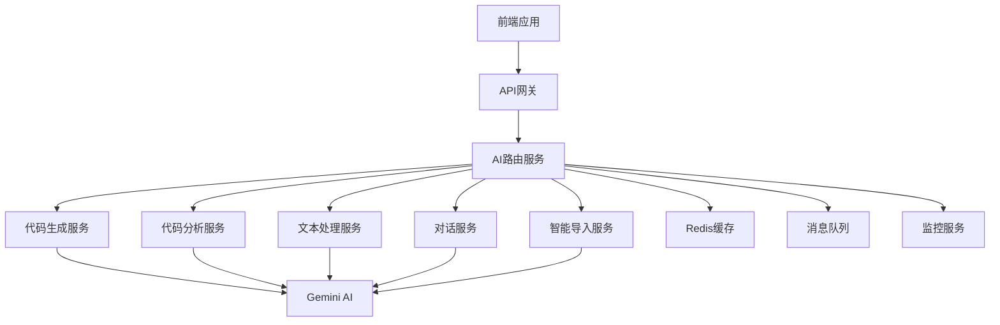

# AI接口文档

## 📋 文档概述

本文档详细描述了Nexus AI平台中所有需要AI接口的功能模块，包括具体的API设计、请求响应格式、错误处理机制等。为后端工程师提供完整的AI服务开发指南。

---

## 🎯 AI功能概览

### 核心AI功能模块

| 功能模块 | AI接口需求 | 优先级 | 状态 |
|---------|------------|--------|------|
| 📝 代码生成器 | 文本生成、代码补全 | P0 | ✅ 已实现 |
| 🔍 代码分析器 | 代码质量分析、效率评分 | P0 | ✅ 已实现 |
| 📄 模板解析器 | 文本解析、结构化提取 | P1 | ✅ 已实现 |
| 💬 反馈摘要器 | 文本摘要、观点提取 | P1 | ✅ 已实现 |
| ⚡ 智能导入 | 内容识别、自动分类 | P1 | 🚧 规划中 |
| 🏷️ 标签生成 | 内容分析、关键词提取 | P2 | 🚧 规划中 |
| 🤖 AI助手 | 对话交互、上下文理解 | P0 | ✅ 已实现 |
| 📊 学习路径 | 个性化推荐、进度分析 | P2 | 🚧 规划中 |

---

## 🔧 AI服务架构

### 服务架构图



### 技术栈

- **AI模型**: Google Gemini 2.5 Flash
- **API框架**: Node.js + Express/Fastify
- **缓存**: Redis
- **消息队列**: RabbitMQ
- **监控**: Prometheus + Grafana
- **日志**: Winston + ELK Stack

---

## 📝 AI接口详细设计

### 1. 代码生成器 (Code Generator)

#### 1.1 基础代码生成

**接口地址**: `POST /api/ai/code/generate`

**功能描述**: 根据用户输入的提示词和上下文生成代码

**请求参数**:
```typescript
interface CodeGenerateRequest {
  prompt: string;           // 必需，用户输入的提示词
  context?: string;         // 可选，项目上下文信息
  language?: string;        // 可选，编程语言，默认：typescript
  framework?: string;       // 可选，框架名称，如：react
  style?: string;          // 可选，代码风格，如：clean-modern
  temperature?: number;    // 可选，创造性参数 0-1，默认：0.3
  maxLength?: number;      // 可选，最大输出长度
}
```

**响应格式**:
```typescript
interface CodeGenerateResponse {
  success: boolean;
  data: {
    code: string;          // 生成的代码
    explanation?: string;   // 代码解释
    suggestions?: string[]; // 改进建议
    confidence: number;     // 置信度 0-1
    usage: {
      promptTokens: number;
      completionTokens: number;
      totalTokens: number;
    };
  };
  error?: {
    code: string;
    message: string;
    details?: any;
  };
}
```

**示例请求**:
```json
{
  "prompt": "创建一个React组件，包含搜索功能和下拉选择器",
  "context": "这是一个电商项目，使用TypeScript和Tailwind CSS",
  "language": "typescript",
  "framework": "react",
  "temperature": 0.3
}
```

**示例响应**:
```json
{
  "success": true,
  "data": {
    "code": "import React, { useState, useCallback } from 'react';\n\ninterface SearchSelectProps {\n  options: Option[];\n  onSelectionChange: (selected: Option[]) => void;\n  placeholder?: string;\n}\n\n// ... 组件实现",
    "explanation": "这是一个功能完整的搜索选择器组件，支持多选、过滤和键盘导航。",
    "suggestions": [
      "考虑添加虚拟滚动以优化大量数据的性能",
      "可以添加自定义渲染功能以支持复杂的选项显示"
    ],
    "confidence": 0.92,
    "usage": {
      "promptTokens": 45,
      "completionTokens": 280,
      "totalTokens": 325
    }
  }
}
```

#### 1.2 基于模板的代码生成

**接口地址**: `POST /api/ai/code/generate-from-template`

**功能描述**: 使用预定义的模板生成代码

**请求参数**:
```typescript
interface TemplateCodeGenerateRequest {
  templateId: string;       // 必需，模板ID
  inputs: Record<string, any>; // 必需，模板参数
  customizations?: {        // 可选，自定义设置
    style?: string;
    framework?: string;
    patterns?: string[];
  };
}
```

---

### 2. 代码分析器 (Code Analyzer)

#### 2.1 代码效率分析

**接口地址**: `POST /api/ai/code/analyze`

**功能描述**: 分析代码质量、性能和最佳实践

**请求参数**:
```typescript
interface CodeAnalyzeRequest {
  code: string;             // 必需，要分析的代码
  language: string;         // 必需，编程语言
  analysisType?: string[];  // 可选，分析类型
  context?: string;         // 可选，项目上下文
  includeSuggestions?: boolean; // 可选，是否包含建议
}
```

**响应格式**:
```typescript
interface CodeAnalyzeResponse {
  success: boolean;
  data: {
    overallScore: number;   // 总体评分 0-100
    metrics: {
      readability: number;   // 可读性评分
      performance: number;   // 性能评分
      maintainability: number; // 可维护性评分
      security: number;      // 安全性评分
    };
    issues: Array<{
      type: 'error' | 'warning' | 'info';
      line: number;
      column: number;
      message: string;
      severity: 'high' | 'medium' | 'low';
    }>;
    suggestions: Array<{
      category: string;
      title: string;
      description: string;
      example?: string;
    }>;
    summary: string;         // 分析摘要
  };
}
```

#### 2.2 代码重构建议

**接口地址**: `POST /api/ai/code/refactor-suggestions`

**功能描述**: 提供代码重构和优化建议

---

### 3. 文本处理服务 (Text Processing Service)

#### 3.1 模板解析器

**接口地址**: `POST /api/ai/text/parse-template`

**功能描述**: 解析用户输入的文本，提取结构化模板信息

**请求参数**:
```typescript
interface ParseTemplateRequest {
  rawText: string;          // 必需，原始文本
  templateType?: string;    // 可选，模板类型
  extractionRules?: Array<{  // 可选，提取规则
    field: string;
    pattern: string;
    required: boolean;
  }>;
}
```

**响应格式**:
```typescript
interface ParseTemplateResponse {
  success: boolean;
  data: {
    template: {
      title: string;
      description: string;
      promptContent: string;
      inputFormat: string;
      outputFormat: string;
      techStack: string[];
      supports: string[];
      appType?: string;
    };
    confidence: number;
    extractedFields: Record<string, any>;
    missingFields: string[];
  };
}
```

#### 3.2 反馈摘要器

**接口地址**: `POST /api/ai/text/summarize-feedback`

**功能描述**: 将多条用户反馈总结成简洁的摘要

**请求参数**:
```typescript
interface SummarizeFeedbackRequest {
  comments: Array<{
    text: string;
    author?: string;
    role?: string;
    timestamp?: number;
  }>;
  summaryType?: 'brief' | 'detailed' | 'actionable';
  focusAreas?: string[];    // 关注领域
}
```

---

### 4. 智能导入服务 (Smart Import Service)

#### 4.1 ⚡ AI Smart Import

**接口地址**: `POST /api/ai/import/smart-parse`

**功能描述**: 智能解析粘贴的文本内容，自动填充表单字段

**请求参数**:
```typescript
interface SmartParseRequest {
  content: string;          // 必需，粘贴的文本内容
  targetType: 'prompt' | 'template' | 'guide'; // 目标类型
  context?: {               // 可选，上下文信息
    category?: string;
    role?: string;
    techStack?: string[];
  };
}
```

**响应格式**:
```typescript
interface SmartParseResponse {
  success: boolean;
  data: {
    parsedFields: Record<string, any>; // 解析出的字段
    suggestedTags: string[];             // 建议的标签
    confidence: number;                   // 解析置信度
    detectedPatterns: Array<{           // 检测到的模式
      type: string;
      value: any;
      confidence: number;
    }>;
    remainingText?: string;              // 未解析的剩余文本
  };
}
```

**示例请求**:
```json
{
  "content": "React性能优化专家\n这是一个用于优化React组件性能的提示词模板，专门解决重渲染问题。\n\n使用场景：当React组件因为状态变化导致不必要的重渲染时，可以使用这个模板来优化性能。\n\n技术栈：React, TypeScript, Tailwind CSS",
  "targetType": "prompt",
  "context": {
    "category": "Optimization",
    "role": "Frontend Dev"
  }
}
```

**示例响应**:
```json
{
  "success": true,
  "data": {
    "parsedFields": {
      "title": "React性能优化专家",
      "description": "用于优化React组件性能，解决重渲染问题",
      "scenario": "当React组件因为状态变化导致不必要的重渲染时",
      "content": "React性能优化提示词模板内容...",
      "techStack": ["React", "TypeScript", "Tailwind CSS"]
    },
    "suggestedTags": ["react", "performance", "optimization", "frontend", "hooks"],
    "confidence": 0.89,
    "detectedPatterns": [
      {
        "type": "tech_stack",
        "value": ["React", "TypeScript", "Tailwind CSS"],
        "confidence": 0.95
      },
      {
        "type": "problem_domain", 
        "value": "performance optimization",
        "confidence": 0.88
      }
    ]
  }
}
```

#### 4.2 🏷️ 标签生成器

**接口地址**: `POST /api/ai/import/generate-tags`

**功能描述**: 基于内容自动生成相关标签

**请求参数**:
```typescript
interface GenerateTagsRequest {
  title: string;            // 必需，标题
  content: string;          // 必需，内容
  existingTags?: string[];   // 可选，已存在标签
  maxTags?: number;         // 可选，最大标签数，默认：10
  tagType?: 'technology' | 'skill' | 'domain' | 'general';
}
```

**响应格式**:
```typescript
interface GenerateTagsResponse {
  success: boolean;
  data: {
    tags: Array<{
      tag: string;
      relevance: number;     // 相关性 0-1
      category: string;      // 标签分类
      confidence: number;    // 置信度
    }>;
    suggestedCategories: string[];
    keywords: string[];      // 提取的关键词
  };
}
```

---

### 5. AI对话服务 (Chat Service)

#### 5.1 对话交互

**接口地址**: `POST /api/ai/chat`

**功能描述**: 处理用户的AI助手对话请求

**请求参数**:
```typescript
interface ChatRequest {
  message: string;           // 必需，用户消息
  conversationId?: string;   // 可选，会话ID
  context?: {               // 可选，上下文信息
    currentProject?: string;
    currentFile?: string;
    selectedCode?: string;
    userRole?: string;
  };
  options?: {
    temperature?: number;
    maxTokens?: number;
    responseFormat?: 'text' | 'markdown' | 'json';
  };
}
```

**响应格式**:
```typescript
interface ChatResponse {
  success: boolean;
  data: {
    response: string;        // AI响应
    conversationId: string;  // 会话ID
    messageId: string;      // 消息ID
    suggestions?: string[];  // 建议的后续问题
    relatedActions?: Array<{ // 相关操作
      type: 'code_gen' | 'analyze' | 'search';
      label: string;
      params: any;
    }>;
    usage: {
      promptTokens: number;
      completionTokens: number;
      totalTokens: number;
    };
  };
}
```

---

## 🔄 工作流AI接口

### 1. 流程模板AI处理

**接口地址**: `POST /api/ai/workflow/process-template`

**功能描述**: 在工作流的各个阶段调用AI处理

```typescript
interface WorkflowProcessRequest {
  stage: 'requirements' | 'product_planning' | 'architecture' | 'story_creation' | 'development' | 'qa';
  templateId: string;
  inputs: Record<string, any>;
  projectContext: {
    projectName: string;
    techStack: string[];
    userStories: string[];
  };
  options?: {
    language: 'zh' | 'en';
    detailLevel: 'brief' | 'standard' | 'detailed';
  };
}

interface WorkflowProcessResponse {
  success: boolean;
  data: {
    output: string;          // 生成的输出内容
    structuredData?: any;    // 结构化数据（如JSON）
    metadata: {
      processingTime: number;
      confidence: number;
      tokensUsed: number;
    };
    nextSteps?: string[];    // 建议的下一步
  };
}
```

---

## ⚙️ 通用AI接口

### 1. 健康检查

**接口地址**: `GET /api/ai/health`

**响应格式**:
```typescript
interface HealthResponse {
  status: 'healthy' | 'degraded' | 'unhealthy';
  services: {
    gemini: 'connected' | 'disconnected';
    cache: 'connected' | 'disconnected';
    queue: 'connected' | 'disconnected';
  };
  metrics: {
    activeRequests: number;
    averageResponseTime: number;
    errorRate: number;
  };
}
```

### 2. 使用统计

**接口地址**: `GET /api/ai/usage/stats`

**响应格式**:
```typescript
interface UsageStatsResponse {
  success: boolean;
  data: {
    totalRequests: number;
    totalTokens: number;
    breakdown: {
      codeGeneration: number;
      codeAnalysis: number;
      textProcessing: number;
      chat: number;
    };
    popularTemplates: Array<{
      templateId: string;
      usageCount: number;
    }>;
    errorRates: Record<string, number>;
  };
}
```

---

## 🚨 错误处理

### 错误码定义

| 错误码 | HTTP状态码 | 描述 | 处理建议 |
|--------|-----------|------|----------|
| AI_001 | 400 | 请求参数无效 | 检查参数格式和必需字段 |
| AI_002 | 401 | API密钥无效或过期 | 刷新API密钥 |
| AI_003 | 403 | 配额超限 | 等待配额重置或升级套餐 |
| AI_004 | 429 | 请求频率过高 | 实施退避策略 |
| AI_005 | 500 | AI服务内部错误 | 重试或联系技术支持 |
| AI_006 | 503 | AI服务不可用 | 等待服务恢复 |
| AI_007 | 508 | 请求超时 | 重试或减小请求复杂度 |

### 错误响应格式

```typescript
interface ErrorResponse {
  success: false;
  error: {
    code: string;
    message: string;
    details?: {
      field?: string;
      expected?: any;
      received?: any;
    };
    retryable: boolean;
    retryAfter?: number;  // 建议重试间隔（秒）
  };
}
```

---

## 🔐 安全与认证

### 1. API密钥管理

- **主密钥**: 用于服务器间通信
- **用户密钥**: 基于用户身份的API密钥
- **临时密钥**: 用于特定操作的临时访问权限

### 2. 请求限制

| 限制类型 | 默认值 | 高级套餐 | 说明 |
|----------|--------|----------|------|
| 每分钟请求数 | 60 | 300 | 基于IP和用户 |
| 每日Token限制 | 100K | 1M | 包括输入和输出 |
| 单请求最大Token | 8K | 32K | 防止资源滥用 |
| 并发连接数 | 10 | 50 | 同时进行的请求数 |

### 3. 内容安全

- 输入内容过滤：恶意代码、敏感信息检测
- 输出内容审查：确保输出符合安全标准
- 数据加密：传输和存储过程中的数据保护

---

## 📊 监控与日志

### 1. 关键指标

- **响应时间**: P50, P95, P99延迟
- **成功率**: 各接口的成功率统计
- **资源使用**: CPU、内存、网络使用情况
- **错误分析**: 错误类型和频率分析

### 2. 日志格式

```json
{
  "timestamp": "2024-01-15T10:30:00.000Z",
  "level": "INFO",
  "service": "ai-service",
  "endpoint": "/api/ai/code/generate",
  "method": "POST",
  "requestId": "req_123456789",
  "userId": "user_123",
  "duration": 1250,
  "status": 200,
  "tokensUsed": 325,
  "error": null
}
```

---

## 🚀 性能优化

### 1. 缓存策略

| 缓存类型 | TTL | 用途 | 键格式 |
|----------|-----|------|--------|
| 代码生成 | 24h | 相同请求的结果 | `code_gen:{prompt_hash}` |
| 代码分析 | 12h | 代码分析结果 | `code_analysis:{code_hash}` |
| 模板解析 | 48h | 解析结果缓存 | `template_parse:{text_hash}` |
| 标签生成 | 72h | 标签建议 | `tags:{content_hash}` |

### 2. 优化建议

- **批量处理**: 支持批量代码生成和分析
- **异步处理**: 耗时操作使用异步模式
- **流式响应**: 长文本生成使用流式传输
- **智能路由**: 根据请求类型路由到最适合的模型

---

## 🧪 测试用例

### 1. 代码生成测试

```typescript
// 测试用例1: 基础React组件生成
const testCase1 = {
  request: {
    prompt: "创建一个按钮组件",
    language: "typescript",
    framework: "react"
  },
  expected: {
    contains: ["export", "interface", "button"],
    notContains: ["class Component"],
    responseTime: "<3000ms"
  }
};
```

### 2. 智能导入测试

```typescript
// 测试用例2: 智能导入功能
const testCase2 = {
  request: {
    content: "React性能优化专家，解决重渲染问题...",
    targetType: "prompt"
  },
  expected: {
    parsedFields: {
      title: "React性能优化专家",
      description: contains("重渲染")
    },
    suggestedTags: includes("react", "performance")
  }
};
```

---

## 📚 SDK与客户端库

### 1. TypeScript/JavaScript SDK

```typescript
import { NexusAIClient } from '@nexus-ai/sdk';

const client = new NexusAIClient({
  apiKey: process.env.NEXUS_AI_API_KEY,
  baseURL: 'https://api.nexus-ai.com'
});

// 代码生成
const codeResult = await client.code.generate({
  prompt: '创建React组件',
  language: 'typescript'
});

// 智能导入
const importResult = await client.import.smartParse({
  content: '粘贴的内容...',
  targetType: 'prompt'
});
```

### 2. Python SDK

```python
from nexus_ai import NexusAIClient

client = NexusAIClient(api_key="your-api-key")

# 代码生成
result = client.code.generate(
    prompt="创建Python类",
    language="python"
)

# 代码分析
analysis = client.code.analyze(
    code="def hello(): pass",
    language="python"
)
```

---

## 🔄 版本管理

### API版本策略

- **v1**: 当前稳定版本
- **v2**: 开发中版本（新功能）
- **v0**: 实验性版本（测试功能）

### 版本兼容性

| 功能 | v0.x | v1.x | v2.x |
|------|------|------|------|
| 代码生成 | ✅ | ✅ | ✅ |
| 代码分析 | ❌ | ✅ | ✅ |
| 智能导入 | ❌ | 🚧 | ✅ |
| 流式响应 | ❌ | ❌ | ✅ |

---

## 📖 使用示例

### 完整的工作流示例

```typescript
// 1. 用户粘贴内容，使用智能导入
const importResult = await fetch('/api/ai/import/smart-parse', {
  method: 'POST',
  headers: { 'Content-Type': 'application/json' },
  body: JSON.stringify({
    content: userPastedContent,
    targetType: 'prompt'
  })
});

// 2. 基于解析结果生成标签
const tagsResult = await fetch('/api/ai/import/generate-tags', {
  method: 'POST',
  headers: { 'Content-Type': 'application/json' },
  body: JSON.stringify({
    title: importResult.data.parsedFields.title,
    content: importResult.data.parsedFields.content
  })
});

// 3. 保存并生成代码
const codeResult = await fetch('/api/ai/code/generate', {
  method: 'POST',
  headers: { 'Content-Type': 'application/json' },
  body: JSON.stringify({
    prompt: importResult.data.parsedFields.promptContent,
    context: projectContext
  })
});

// 4. 分析生成的代码质量
const analysisResult = await fetch('/api/ai/code/analyze', {
  method: 'POST',
  headers: { 'Content-Type': 'application/json' },
  body: JSON.stringify({
    code: codeResult.data.code,
    language: 'typescript'
  })
});
```

---

## 🎯 开发路线图

### Q1 2024 - 核心功能完善
- ✅ 基础代码生成
- ✅ 代码质量分析
- ✅ 智能导入功能
- 🚧 流式响应支持

### Q2 2024 - 高级功能
- 📋 代码重构建议
- 🔄 批量处理API
- 🤖 多模型支持
- 📊 高级分析功能

### Q3 2024 - 优化与扩展
- ⚡ 性能优化
- 🌐 多语言支持
- 🔌 插件系统
- 📱 移动端适配

---

## 📞 技术支持

### 联系方式
- **技术支持邮箱**: ai-support@nexus-ai.com
- **API文档**: https://docs.nexus-ai.com/api
- **GitHub仓库**: https://github.com/nexus-ai/api
- **开发者社区**: https://community.nexus-ai.com

### 常见问题
- [API密钥获取指南](https://docs.nexus-ai.com/guides/api-keys)
- [配额和计费说明](https://docs.nexus-ai.com/guides/billing)
- [错误排查指南](https://docs.nexus-ai.com/guides/troubleshooting)
- [最佳实践建议](https://docs.nexus-ai.com/guides/best-practices)

---

*最后更新: 2024年1月15日*  
*文档版本: v1.2.0*  
*维护者: Nexus AI技术团队*