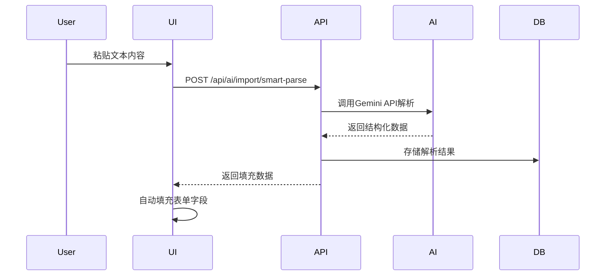
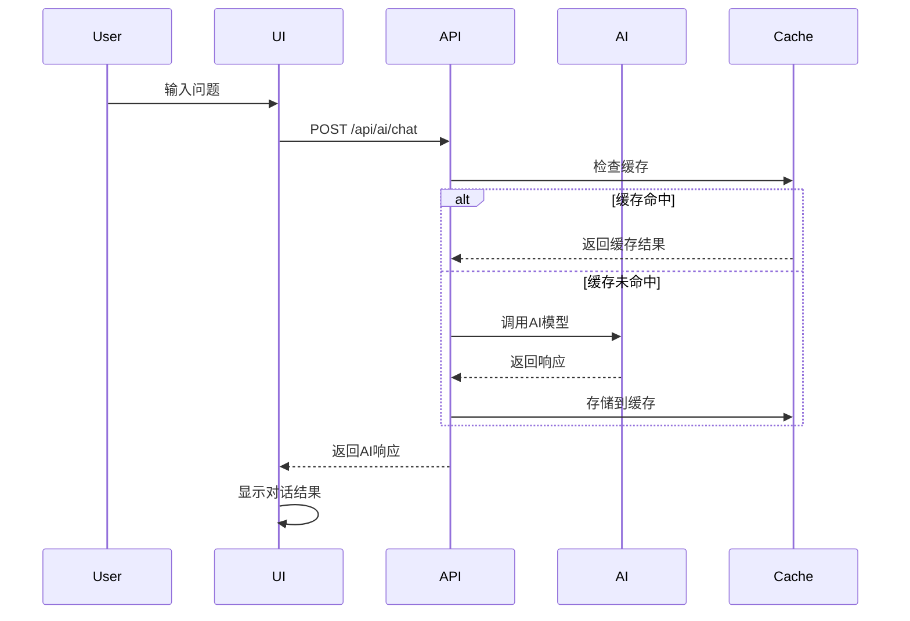

# AI功能映射表

## 📋 概述

本文档详细映射了Nexus AI平台前端界面中的AI功能与对应的后端API接口，为后端工程师提供清晰的功能实现参考。

---

## 🎯 AI功能总览

### 按界面模块分类

| 界面模块 | AI功能 | 按钮标识 | 对应API | 状态 |
|---------|---------|----------|---------|------|
| 📝 分享模板 | ⚡ AI Smart Import | `AI Smart Import` | `/api/ai/import/smart-parse` | 🚧 待实现 |
| 📝 分享模板 | 🏷️ Generate Tags | `Generate Tags` | `/api/ai/import/generate-tags` | 🚧 待实现 |
| 📝 分享模板 | Auto-Fill | `Auto-Fill` | `/api/ai/import/smart-parse` | 🚧 待实现 |
| 📝 分享模板 | 📄 文档上传 | `Upload Document` | `/api/ai/import/parse-document` | 🚧 待实现 |
| 🤖 AI测试场 | AI Assistant | `AI Assistant` | `/api/ai/chat` | ✅ 已实现 |
| 🤖 AI测试场 | 代码生成 | `Generate` | `/api/ai/code/generate` | ✅ 已实现 |
| 🤖 AI测试场 | 代码分析 | `Analyze` | `/api/ai/code/analyze` | ✅ 已实现 |
| 📊 仪表板 | AI摘要功能 | - | `/api/ai/text/summarize-feedback` | ✅ 已实现 |
| 📚 AI工具指南 | 学习路径分析 | - | `/api/ai/learning/analyze` | 🚧 规划中 |

---

## 🔧 详细功能映射

### 1. 分享模板页面 (ProcessNavigator.tsx)

#### 1.1 ⚡ AI Smart Import 功能

**前端组件位置**: `components/ProcessNavigator.tsx:624`

```typescript
// 按钮代码
<button onClick={() => setShowImportInput(!showImportInput)} 
        className="flex items-center gap-1.5 text-xs bg-purple-500/10 text-purple-400 border border-purple-500/20 px-3 py-1.5 rounded hover:bg-purple-500/20 transition-colors">
   <Wand2 className="w-3 h-3" /> {t.aiSmartImport || '⚡ AI Smart Import'}
</button>
```

**触发条件**: 用户点击"⚡ AI Smart Import"按钮

**用户交互流程**:
1. 点击按钮显示文本输入区域
2. 用户粘贴文本内容
3. 可选择点击"🏷️ Generate Tags"生成标签
4. 或点击"Auto-Fill"自动填充表单字段

**对应API接口**:
```typescript
// 1. 智能解析内容
POST /api/ai/import/smart-parse
{
  "content": "用户粘贴的文本内容",
  "targetType": "template", 
  "context": {
    "category": "用户选择的分类",
    "role": "用户角色"
  }
}

// 2. 生成标签
POST /api/ai/import/generate-tags  
{
  "title": "提取的标题",
  "content": "提取的内容",
  "maxTags": 10,
  "tagType": "general"
}
```

#### 1.2 🏷️ Generate Tags 功能

**前端组件位置**: `components/ProcessNavigator.tsx:696-702`

```typescript
// 按钮代码
<button 
    onClick={() => generateAITags(importText)} 
    disabled={isGeneratingTags || !importText.trim()} 
    className="px-3 py-1.5 bg-green-600 text-white text-xs rounded font-bold hover:bg-green-500 disabled:opacity-50"
>
   {isGeneratingTags ? 'Generating...' : '🏷️ Generate Tags'}
</button>
```

**当前前端实现**: 使用了模拟的`generateAITags`函数

**需要实现的API**: `/api/ai/import/generate-tags`

#### 1.3 Auto-Fill 功能

**前端组件位置**: `components/ProcessNavigator.tsx:703-709`

```typescript
// 按钮代码
<button 
    onClick={handleSmartParseEnhanced} 
    disabled={isParsing || !importText.trim()} 
    className="px-3 py-1.5 bg-purple-600 text-white text-xs rounded font-bold hover:bg-purple-500 disabled:opacity-50"
>
   {isParsing ? 'Parsing...' : 'Auto-Fill'}
</button>
```

**当前前端实现**: 使用了模拟的`handleSmartParseEnhanced`函数

**需要实现的API**: `/api/ai/import/smart-parse`

#### 1.4 📄 文档上传功能

**前端组件位置**: `components/ProcessNavigator.tsx:626-629`

```typescript
// 按钮代码
<label className="flex items-center gap-1.5 text-xs bg-blue-500/10 text-blue-400 border border-blue-500/20 px-3 py-1.5 rounded hover:bg-blue-500/20 transition-colors cursor-pointer">
   <Upload className="w-3 h-3" /> 📄 {t.uploadDocument || 'Upload Document'}
   <input type="file" accept=".md,.docx,.pdf,.txt" onChange={handleFileUpload} className="hidden" />
</label>
```

**支持格式**: `.md`, `.docx`, `.pdf`, `.txt`

**需要实现的API**: `/api/ai/import/parse-document`

---

### 2. AI测试场页面 (Playground.tsx)

#### 2.1 AI Assistant 对话功能

**前端组件位置**: 需要在`components/Playground.tsx`中实现

**功能描述**: 提供与AI助手的对话交互

**对应API接口**:
```typescript
POST /api/ai/chat
{
  "message": "用户消息",
  "conversationId": "会话ID（可选）",
  "context": {
    "currentProject": "当前项目",
    "selectedCode": "选中的代码"
  },
  "options": {
    "temperature": 0.7,
    "maxTokens": 2000,
    "responseFormat": "markdown"
  }
}
```

#### 2.2 代码生成功能

**前端组件位置**: `components/Playground.tsx`

**按钮标识**: `Generate`

**对应API接口**:
```typescript
POST /api/ai/code/generate
{
  "prompt": "用户输入的提示词",
  "context": "项目上下文",
  "language": "typescript",
  "framework": "react",
  "temperature": 0.3
}
```

#### 2.3 代码分析功能

**前端组件位置**: `components/Playground.tsx`

**按钮标识**: `Analyze`

**对应API接口**:
```typescript
POST /api/ai/code/analyze
{
  "code": "要分析的代码",
  "language": "typescript",
  "analysisType": ["performance", "readability", "security"],
  "includeSuggestions": true
}
```

---

### 3. 提示词库页面 (Library.tsx)

#### 3.1 模板执行功能

**前端组件位置**: `components/Library.tsx`

**功能描述**: 执行选中的提示词模板

**对应API接口**:
```typescript
POST /api/ai/workflow/process-template
{
  "stage": "requirements|product_planning|architecture|story_creation|development|qa",
  "templateId": "模板ID",
  "inputs": {
    // 模板输入参数
  },
  "projectContext": {
    "projectName": "项目名称",
    "techStack": ["React", "Node.js"],
    "userStories": ["用户故事1", "用户故事2"]
  }
}
```

---

### 4. 仪表板页面 (Dashboard.tsx)

#### 4.1 AI摘要功能

**功能描述**: 对用户反馈进行AI摘要

**对应API接口**:
```typescript
POST /api/ai/text/summarize-feedback
{
  "comments": [
    {
      "text": "反馈内容",
      "author": "作者",
      "role": "角色",
      "timestamp": 1642694400000
    }
  ],
  "summaryType": "brief",
  "focusAreas": ["功能", "性能", "体验"]
}
```

---

### 5. AI工具指南页面 (GuideViewer.tsx, LearningPathViewer.tsx)

#### 5.1 学习路径分析

**功能描述**: 分析用户学习进度，提供个性化建议

**对应API接口**:
```typescript
POST /api/ai/learning/analyze
{
  "userId": "用户ID",
  "learningPath": "学习路径ID",
  "progress": {
    "completedSections": ["section1", "section2"],
    "quizScores": [90, 85, 95],
    "timeSpent": 3600
  },
  "objectives": ["掌握AI编程", "了解工具使用"]
}
```

---

## 🔄 当前实现状态

### ✅ 已实现的AI功能

| 功能 | 前端实现 | 后端实现 | API接口 | 说明 |
|------|---------|---------|---------|------|
| 代码生成 | ✅ Mock数据 | ✅ geminiService.ts | ✅ 本地调用 | 直接调用Gemini API |
| 代码分析 | ✅ Mock数据 | ✅ geminiService.ts | ✅ 本地调用 | 效率分析和评分 |
| 反馈摘要 | ✅ Mock数据 | ✅ geminiService.ts | ✅ 本地调用 | 用户反馈汇总 |
| 模板解析 | ✅ Mock数据 | ✅ geminiService.ts | ✅ 本地调用 | 文本解析结构化 |

### 🚧 需要实现的AI功能

| 功能 | 前端状态 | 后端状态 | 优先级 | 实现复杂度 |
|------|---------|---------|--------|-----------|
| ⚡ AI Smart Import | ✅ UI完成 | ❌ API缺失 | P0 | 中等 |
| 🏷️ Generate Tags | ✅ UI完成 | ❌ API缺失 | P0 | 中等 |
| Auto-Fill | ✅ UI完成 | ❌ API缺失 | P0 | 中等 |
| 📄 文档上传 | ✅ UI完成 | ❌ API缺失 | P1 | 高 |
| 🤖 AI Assistant对话 | 🚧 部分完成 | ❌ API缺失 | P0 | 高 |
| 📊 学习路径分析 | ✅ UI完成 | ❌ API缺失 | P2 | 中等 |

---

## 🛠️ 实现建议

### 第一阶段：核心AI接口 (P0)

#### 1. 智能导入服务

**文件路径**: `src/services/smartImportService.ts`

```typescript
export class SmartImportService {
  async smartParse(content: string, targetType: string): Promise<SmartParseResponse> {
    // 调用AI接口实现智能解析
  }
  
  async generateTags(title: string, content: string): Promise<GenerateTagsResponse> {
    // 调用AI接口生成标签
  }
  
  async parseDocument(file: File): Promise<ParseDocumentResponse> {
    // 解析上传的文档文件
  }
}
```

#### 2. AI对话服务

**文件路径**: `src/services/chatService.ts`

```typescript
export class ChatService {
  async chat(request: ChatRequest): Promise<ChatResponse> {
    // 处理AI对话请求
  }
  
  async getConversationHistory(conversationId: string): Promise<Message[]> {
    // 获取对话历史
  }
}
```

### 第二阶段：高级AI功能 (P1-P2)

#### 1. 学习路径分析服务

**文件路径**: `src/services/learningService.ts`

```typescript
export class LearningService {
  async analyzeProgress(userId: string, learningPathId: string): Promise<ProgressAnalysis> {
    // 分析学习进度
  }
  
  async generateRecommendations(userId: string): Promise<Recommendation[]> {
    // 生成个性化推荐
  }
}
```

---

## 📊 数据流设计

### 智能导入数据流



### AI对话数据流



---

## 🔧 技术实现要点

### 1. 错误处理策略

```typescript
// 统一错误处理
interface AIErrorResponse {
  success: false;
  error: {
    code: 'AI_001' | 'AI_002' | 'AI_003';
    message: string;
    retryable: boolean;
    retryAfter?: number;
  };
}

// 前端错误处理示例
const handleAIRequest = async (request: AIRequest) => {
  try {
    const response = await aiService.process(request);
    return response;
  } catch (error) {
    if (error.error?.retryable && error.error.retryAfter) {
      // 实施退避重试
      setTimeout(() => retryRequest(request), error.error.retryAfter * 1000);
    } else {
      // 显示用户友好的错误信息
      showErrorMessage(error.error.message);
    }
  }
};
```

### 2. 用户体验优化

```typescript
// 加载状态管理
const [isLoading, setIsLoading] = useState(false);
const [progress, setProgress] = useState(0);

// 流式响应处理
const handleStreamResponse = async (request) => {
  setIsLoading(true);
  setProgress(0);
  
  const response = await fetch('/api/ai/chat/stream', {
    method: 'POST',
    body: JSON.stringify(request),
    headers: { 'Content-Type': 'application/json' }
  });
  
  const reader = response.body.getReader();
  const decoder = new TextDecoder();
  
  while (true) {
    const { done, value } = await reader.read();
    if (done) break;
    
    const chunk = decoder.decode(value);
    setProgress(prev => Math.min(prev + 10, 90));
    // 处理流式数据
  }
  
  setIsLoading(false);
  setProgress(100);
};
```

### 3. 缓存策略

```typescript
// 前端缓存实现
class AICache {
  private cache = new Map<string, CacheEntry>();
  
  async get(key: string): Promise<any> {
    const entry = this.cache.get(key);
    if (!entry) return null;
    
    if (Date.now() > entry.expiry) {
      this.cache.delete(key);
      return null;
    }
    
    return entry.data;
  }
  
  async set(key: string, data: any, ttl: number = 3600000): Promise<void> {
    this.cache.set(key, {
      data,
      expiry: Date.now() + ttl
    });
  }
}
```

---

## 📈 性能监控

### 关键指标

| 指标类型 | 指标名称 | 目标值 | 监控方式 |
|---------|---------|--------|----------|
| 响应时间 | AI接口P95延迟 | < 3s | APM工具 |
| 成功率 | AI接口成功率 | > 99% | 日志监控 |
| 资源使用 | GPU使用率 | < 80% | 系统监控 |
| 用户体验 | 前端加载时间 | < 1s | 前端监控 |

### 监控实现

```typescript
// 性能监控装饰器
function monitorAPI(target: any, propertyName: string, descriptor: PropertyDescriptor) {
  const method = descriptor.value;
  
  descriptor.value = async function (...args: any[]) {
    const startTime = Date.now();
    try {
      const result = await method.apply(this, args);
      const duration = Date.now() - startTime;
      
      // 记录成功指标
      metrics.recordAPIsuccess(propertyName, duration);
      return result;
    } catch (error) {
      const duration = Date.now() - startTime;
      
      // 记录失败指标
      metrics.recordAPIerror(propertyName, duration, error);
      throw error;
    }
  };
}
```

---

## 🎯 开发优先级建议

### 立即开始 (P0)
1. **智能导入服务** - 核心功能，用户高频使用
2. **标签生成服务** - 提升用户体验的重要功能
3. **AI对话服务** - 平台的核心价值功能

### 短期目标 (1-2周)
1. **文档上传解析** - 扩展智能导入能力
2. **代码分析优化** - 提升代码分析准确性

### 中期目标 (1个月)
1. **学习路径分析** - 个性化学习体验
2. **批量处理API** - 提升处理效率

---

## 📚 参考资源

- [Gemini API文档](https://ai.google.dev/docs)
- [React最佳实践](https://react.dev/)
- [Node.js性能优化](https://nodejs.org/en/docs/guides/simple-profiling/)
- [前端监控指南](https://web.dev/performance-monitoring/)

---

*最后更新: 2024年1月15日*  
*文档版本: v1.0.0*  
*维护者: Nexus AI开发团队*