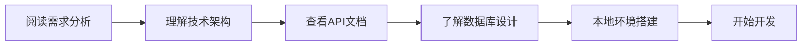

# Nexus AI Platform - 开发文档中心

**版本**: 1.0  
**更新日期**: 2024年12月2日  
**维护团队**: Nexus AI 开发团队  

---

## 📋 文档概览

本文档中心为Nexus AI Platform项目的完整开发文档，专为后端工程师和全栈开发者设计。所有文档都已更新到最新版本，涵盖了从需求分析到部署的完整开发流程。

---

## 🗂️ 文档结构

### 📊 核心文档 (必读)

| 文档 | 描述 | 适用角色 | 优先级 |
|------|------|----------|--------|
| **[需求分析](./01-需求分析.md)** | 详细的市场需求分析和用户画像 | 产品经理、后端、前端 | 🔴 P0 |
| **[产品需求文档(PRD)](./02-产品需求文档(PRD).md)** | 完整的功能规格和产品规划 | 所有开发者 | 🔴 P0 |
| **[用户故事文档](./03-用户故事文档.md)** | 详细的用户故事和验收标准 | 后端、测试 | 🔴 P0 |
| **[技术架构设计](./04-技术架构设计.md)** | 完整的系统架构和技术选型 | 后端、架构师 | 🔴 P0 |
| **[API接口文档](./05-API接口文档.md)** | 完整的RESTful API规范 | 后端、前端 | 🔴 P0 |
| **[数据库设计](./06-数据库设计.md)** | 数据库模型和优化策略 | 后端、DBA | 🔴 P0 |
| **[部署指南](./07-部署指南.md)** | 完整的部署和运维指南 | DevOps、后端 | 🔴 P0 |

---

## 🚀 快速开始指南

### 1. 后端工程师入门流程



**推荐阅读顺序**：
1. 📖 **需求分析** → 理解项目背景和用户需求
2. 🏗️ **技术架构** → 了解整体技术方案
3. 🔌 **API文档** → 掌握接口规范
4. 🗄️ **数据库设计** → 理解数据模型
5. 🚀 **部署指南** → 了解部署流程

### 2. 关键技术栈快速参考

| 技术领域 | 技术 | 版本 | 相关文档 |
|----------|------|------|----------|
| **后端框架** | Node.js + Express | 20+ | [技术架构](./04-技术架构设计.md#32-微服务架构) |
| **数据库** | PostgreSQL | 15+ | [数据库设计](./06-数据库设计.md) |
| **缓存** | Redis | 7+ | [数据库设计](./06-数据库设计.md#15-redis缓存) |
| **搜索** | Elasticsearch | 8.11+ | [数据库设计](./06-数据库设计.md#16-elasticsearch) |
| **AI服务** | Gemini + OpenAI | Latest | [API文档](./05-API接口文档.md#5-ai服务api) |
| **容器化** | Docker + K8s | Latest | [部署指南](./07-部署指南.md) |

---

## 📖 文档详细说明

### 1. 需求分析 (01-需求分析.md)

**关键内容**：
- 市场背景和产品定位
- 核心功能需求
- 用户角色和权限
- 技术风险和应对策略
- 成功指标定义

**后端工程师关注点**：
- 理解各功能模块的技术要求
- 了解性能指标和技术约束
- 掌握用户权限体系

---

### 2. 产品需求文档 (02-产品需求文档(PRD).md)

**关键内容**：
- 完整的功能模块规格
- 详细的技术架构设计
- API接口设计概览
- 数据模型定义
- 用户体验设计

**后端工程师关注点**：
- 每个功能模块的技术实现要求
- API设计规范和数据格式
- 性能和安全要求
- 用户认证和权限控制

---

### 3. 用户故事文档 (03-用户故事文档.md)

**关键内容**：
- 48个详细用户故事
- 完整的验收标准
- 迭代计划和优先级
- 测试覆盖率要求
- 成功度量指标

**后端工程师关注点**：
- 理解每个功能的业务逻辑
- 掌握验收标准和测试要求
- 了解开发优先级和时间安排
- 性能指标的量化要求

---

### 4. 技术架构设计 (04-技术架构设计.md)

**关键内容**：
- 微服务架构设计
- 前后端技术栈选择
- AI服务集成架构
- 安全架构设计
- 性能优化策略
- 监控和运维架构

**后端工程师关注点**：
- 微服务拆分和通信方式
- 数据库设计和缓存策略
- AI服务集成和成本优化
- 安全机制和权限控制
- 性能调优和监控方案

---

### 5. API接口文档 (05-API接口文档.md)

**关键内容**：
- 完整的RESTful API规范
- 详细的请求/响应示例
- 错误处理和状态码
- 认证授权机制
- API限流和安全策略
- SDK使用示例

**后端工程师关注点**：
- **必须**严格按照此文档实现接口
- 统一的响应格式和错误处理
- 认证授权和权限控制
- 性能优化和安全防护
- 接口版本控制策略

---

### 6. 数据库设计 (06-数据库设计.md)

**关键内容**：
- 完整的数据库表结构设计
- 索引优化策略
- 数据迁移和版本控制
- 备份恢复策略
- 性能监控和调优
- 安全和数据加密

**后端工程师关注点**：
- **必须**严格按照此设计实现数据库
- 理解表关系和约束
- 掌握索引优化和查询性能
- 数据安全和备份策略
- 监控和故障处理

---

### 7. 部署指南 (07-部署指南.md)

**关键内容**：
- Docker Compose本地开发环境
- Kubernetes生产环境部署
- CI/CD流水线配置
- 监控和日志系统
- 备份恢复策略
- 安全配置和最佳实践

**后端工程师关注点**：
- 本地开发环境搭建
- 容器化配置和Dockerfile
- Kubernetes部署配置
- 监控告警配置
- 故障排除和性能调优

---

## 🔧 开发工具和资源

### 1. 必备工具

| 工具类型 | 推荐工具 | 用途 |
|----------|----------|------|
| **IDE** | VS Code / WebStorm | 代码开发和调试 |
| **数据库工具** | DBeaver / pgAdmin | 数据库管理和查询 |
| **API测试** | Postman / Insomnia | API接口测试 |
| **版本控制** | Git / GitHub | 代码版本管理 |
| **容器化** | Docker / kubectl | 容器管理和部署 |
| **监控** | Grafana / Kibana | 系统监控和日志查看 |

### 2. 开发环境快速搭建

```bash
# 1. 克隆项目
git clone https://github.com/Jinnn0309/ai-coder-nexus.git
cd ai-coder-nexus

# 2. 设置环境变量
cp .env.example .env
# 编辑 .env 文件，填入必要的配置

# 3. 启动开发环境
./scripts/deploy.sh

# 4. 验证服务状态
curl http://localhost:8080/health
```

### 3. 常用命令速查

```bash
# Docker Compose 命令
docker-compose up -d                    # 启动所有服务
docker-compose logs -f [service-name]   # 查看服务日志
docker-compose down                     # 停止所有服务
docker-compose exec [service] bash       # 进入服务容器

# Kubernetes 命令
kubectl get pods -n nexus-ai            # 查看Pod状态
kubectl logs -f [pod-name]              # 查看Pod日志
kubectl apply -f [manifest-file]        # 应用配置
kubectl scale deployment [name] --replicas=3  # 扩容服务

# 数据库命令
psql -h localhost -U nexus -d nexus    # 连接PostgreSQL
redis-cli -h localhost -p 6379         # 连接Redis
```

---

## 📞 技术支持

### 1. 团队联系方式

| 角色 | 联系方式 | 负责内容 |
|------|----------|----------|
| **技术负责人** | tech@nexus-ai.com | 架构设计、技术决策 |
| **后端负责人** | backend@nexus-ai.com | 后端开发、API设计 |
| **数据库负责人** | dba@nexus-ai.com | 数据库设计、性能优化 |
| **DevOps负责人** | devops@nexus-ai.com | 部署运维、监控告警 |
| **产品负责人** | product@nexus-ai.com | 需求分析、功能规划 |

### 2. 问题反馈渠道

| 问题类型 | 反馈渠道 | 响应时间 |
|----------|----------|----------|
| **Bug报告** | GitHub Issues | 24小时内 |
| **功能请求** | GitHub Discussions | 48小时内 |
| **架构问题** | 技术负责人邮件 | 12小时内 |
| **紧急问题** | Slack/微信技术群 | 立即响应 |

### 3. 文档维护

- **更新频率**: 每个Sprint结束后更新
- **版本控制**: Git管理，语义化版本
- **评审流程**: 技术负责人审核
- **同步机制**: 文档变更通知相关团队

---

## 🎯 开发规范

### 1. 代码规范

```typescript
// TypeScript示例
export class UserService {
  constructor(
    private readonly userRepository: UserRepository,
    private readonly cacheService: CacheService
  ) {}

  async createUser(userData: CreateUserDto): Promise<User> {
    // 参数验证
    if (!userData.email || !userData.username) {
      throw new BadRequestError('Email and username are required');
    }

    // 业务逻辑
    const existingUser = await this.userRepository.findByEmail(userData.email);
    if (existingUser) {
      throw new ConflictError('User already exists');
    }

    // 创建用户
    const user = await this.userRepository.create(userData);
    
    // 缓存用户信息
    await this.cacheService.set(`user:${user.id}`, user, 3600);
    
    return user;
  }
}
```

### 2. API设计规范

```typescript
// 控制器示例
@Controller('/api/v1/users')
@ApiTags('Users')
export class UserController {
  constructor(private readonly userService: UserService) {}

  @Post()
  @ApiOperation({ summary: 'Create new user' })
  @ApiResponse({ status: 201, description: 'User created successfully' })
  async createUser(@Body() createUserDto: CreateUserDto): Promise<ApiResponse<User>> {
    const user = await this.userService.createUser(createUserDto);
    
    return {
      success: true,
      code: 201,
      message: 'User created successfully',
      data: user,
      timestamp: Date.now()
    };
  }
}
```

### 3. 数据库操作规范

```typescript
// Repository示例
export class UserRepository {
  async create(userData: CreateUserDto): Promise<User> {
    const user = await this.prisma.user.create({
      data: {
        email: userData.email,
        username: userData.username,
        passwordHash: await this.hashPassword(userData.password),
        role: userData.role || 'developer'
      }
    });
    
    return this.toDomainEntity(user);
  }

  async findByEmail(email: string): Promise<User | null> {
    const user = await this.prisma.user.findUnique({
      where: { email }
    });
    
    return user ? this.toDomainEntity(user) : null;
  }

  private async hashPassword(password: string): Promise<string> {
    const salt = await bcrypt.genSalt(10);
    return bcrypt.hash(password, salt);
  }
}
```

---

## 📚 学习资源

### 1. 技术文档

| 技术 | 官方文档 | 推荐教程 |
|------|----------|----------|
| **Node.js** | [Node.js Docs](https://nodejs.org/docs/) | [Node.js Best Practices](https://github.com/goldbergyoni/nodebestpractices) |
| **TypeScript** | [TypeScript Docs](https://www.typescriptlang.org/docs/) | [TypeScript Deep Dive](https://basarat.gitbook.io/typescript/) |
| **PostgreSQL** | [PostgreSQL Docs](https://www.postgresql.org/docs/) | [PostgreSQL Tutorial](https://www.postgresqltutorial.com/) |
| **Redis** | [Redis Docs](https://redis.io/documentation) | [Redis Best Practices](https://redis.io/topics/memory-optimization) |
| **Kubernetes** | [K8s Docs](https://kubernetes.io/docs/) | [Kubernetes Patterns](https://kubernetes.io/docs/concepts/) |

### 2. 开发工具教程

| 工具 | 学习资源 | 备注 |
|------|----------|------|
| **Docker** | [Docker Get Started](https://docs.docker.com/get-started/) | 容器化基础 |
| **Helm** | [Helm Docs](https://helm.sh/docs/) | Kubernetes包管理 |
| **Prometheus** | [Prometheus Docs](https://prometheus.io/docs/) | 监控系统 |
| **Grafana** | [Grafana Docs](https://grafana.com/docs/) | 数据可视化 |
| **GitLab CI** | [GitLab CI Docs](https://docs.gitlab.com/ee/ci/) | CI/CD流水线 |

---

## 🏆 项目里程碑

### 已完成 ✅
- [x] 项目初始化和架构设计
- [x] 需求分析和用户故事编写
- [x] 技术选型和架构设计
- [x] 数据库设计和API规范
- [x] 部署方案和CI/CD配置
- [x] 文档体系建立

### 进行中 🔄
- [ ] 后端核心服务开发
- [ ] 前端界面开发
- [ ] AI服务集成
- [ ] 测试用例编写
- [ ] 性能优化

### 计划中 📋
- [ ] 安全加固
- [ ] 监控告警完善
- [ ] 文档持续更新
- [ ] 用户培训材料
- [ ] 运维手册

---

## 📈 项目统计

| 指标 | 当前值 | 目标值 |
|------|--------|--------|
| **文档数量** | 8个 | 10个 |
| **API接口** | 45个 | 60个 |
| **数据库表** | 15个 | 20个 |
| **用户故事** | 48个 | 60个 |
| **代码覆盖率** | 0% | 85% |
| **文档完整性** | 95% | 100% |

---

## 🎉 致谢

感谢所有参与Nexus AI Platform项目的团队成员，特别是：

- **产品团队**: 需求分析和产品设计
- **架构团队**: 技术架构和技术选型
- **后端团队**: 核心服务开发和API设计
- **前端团队**: 用户界面和交互体验
- **DevOps团队**: 部署运维和监控告警
- **测试团队**: 质量保证和测试用例

---

*最后更新: 2024年12月2日*  
*文档版本: 1.0*  
*维护团队: Nexus AI 开发团队*  

---

**💡 提示**: 请将此文档中心收藏，随时查阅。如有任何问题或建议，欢迎通过上述联系方式反馈。